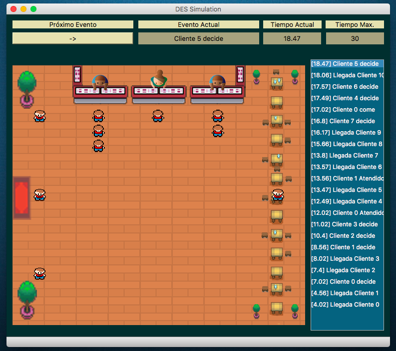

# Discrete Event Simulation (DES)

#### Ejemplo visual simple de una simulación de eventos discretos ([DES]) con el objetivo de hacer más facil la comprensión del funcionamiento de este tipo de simulación. 

## Requerimientos

#### - Python3 
#### - PyQt5

## Funcionamiento

#### Run `main.py` 

  
  
"Pantallazo de la interfaz"

**Versión de prueba**

[DES]: https://en.wikipedia.org/wiki/Discrete_event_simulation